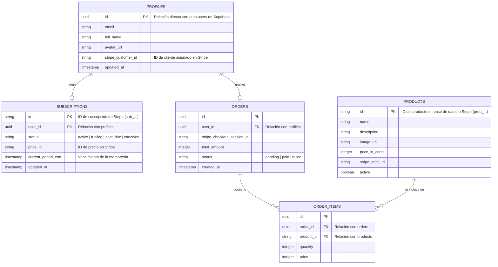

# 📑 Sección 4: Configuración de la Base de Datos

Esta sección describe el modelo de base de datos relacional y los servicios de almacenamiento alojados en **Supabase** (PostgreSQL) para gestionar los usuarios, las suscripciones y el contenido del portafolio.

---

## 🗄️ Arquitectura de Base de Datos (PostgreSQL)

Se proponen las siguientes tablas esenciales para el correcto funcionamiento del dashboard, control de membresías de Stripe y almacenamiento de compras.

---

## 🔒 Seguridad de Acceso (Row Level Security - RLS)

Supabase requiere la activación de RLS en todas las tablas públicas para proteger los datos de accesos indebidos desde las llamadas directas del cliente:

1. **Tabla `profiles`**:
   - Lectura: Permitido solo si el ID autenticado coincide con el ID de la fila (`auth.uid() = id`).
   - Escritura: Permitido al usuario dueño para modificar sus datos personales, o al rol de servicio del servidor (`service_role`).
2. **Tabla `subscriptions`**:
   - Lectura: Solo el usuario dueño puede consultar su estado de membresía.
   - Escritura: Bloqueado por completo en el cliente. Solo modificable desde el backend a través de eventos seguros de Stripe Webhooks.
3. **Tabla `products`**:
   - Lectura: Acceso de lectura público habilitado para que los usuarios no autenticados puedan ver el catálogo.
   - Escritura: Restringido únicamente a administradores.

---

## 📁 Almacenamiento de Archivos (Supabase Storage)

Se configuran dos cubos (Buckets) principales en Supabase Storage para alojar los activos multimedia del portafolio:

### 1. Bucket `portfolio-media` (Público)
- **Uso**: Contiene las imágenes artísticas de las colecciones presentadas en la sección [Galerías](file:///C:/REPOS/EloyWasll%20dashboard/portafolio%20STUDIO/EW/app/galeria/page.jsx) e [Diseño](file:///C:/REPOS/EloyWasll%20dashboard/portafolio%20STUDIO/EW/app/diseno/page.jsx).
- **Acceso**: Público para optimizar la velocidad de entrega a través de CDN global.

### 2. Bucket `user-avatars` (Público/Protegido)
- **Uso**: Fotos de perfil de los usuarios del dashboard.
- **Acceso**: Lectura pública, pero la subida de archivos está limitada a usuarios autenticados, restringiendo que solo puedan modificar archivos bajo su propia carpeta (`/avatars/{auth.uid()}/*`).
