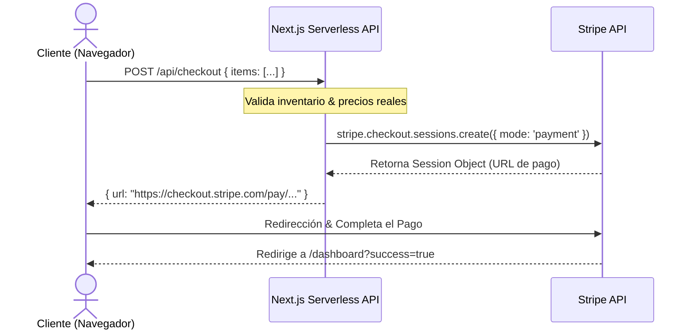

# 📑 Sección 5: Integración de Pagos con Stripe

Esta sección detalla cómo interactúa la aplicación con **Stripe** para procesar pagos de productos de la tienda y gestionar las membresías exclusivas de los usuarios.

---

## 💳 Flujo de Compra Única (Stripe Checkout)

Para la venta de obras de arte, mercancía de edición limitada u otros accesorios se utiliza el flujo de cobro único.

---

## ⭐ Flujo de Membresía VIP (Suscripción Recurrente)

El acceso al dashboard exclusivo y eventos VIP funciona bajo un esquema mensual o anual:
1. **Inicio de Registro**: El usuario autenticado selecciona el plan de membresía.
2. **Creación del Cliente**: Si el perfil de base de datos no cuenta con `stripe_customer_id`, la API crea un registro en Stripe.
3. **Session Mode**: Se crea la sesión de cobro en modo `subscription` enviando el `price_id` correspondiente al plan de membresía.
4. **Verificación**: Tras pagar, el cliente es redirigido a la aplicación y espera a que el webhook valide la suscripción.

---

## ⚡ Manejo de Eventos (Stripe Webhooks)

Dado que las compras y renovaciones pueden demorar o fallar debido a múltiples factores bancarios, el estado de las transacciones se actualiza asíncronamente en el endpoint `/api/webhook`.

> [!IMPORTANT]
> Todos los payloads recibidos en `/api/webhook` deben ser validados verificando la firma `stripe-signature` provista por Stripe para evitar peticiones falsas que intenten forzar desbloqueos.

### Eventos Clave Soportados

| Evento de Stripe | Origen | Acción en Base de Datos |
| :--- | :--- | :--- |
| `checkout.session.completed` | Checkout / Suscripciones | Inserta orden de compra en estado `paid`. Registra el `stripe_customer_id` en el perfil del usuario. |
| `invoice.payment_succeeded` | Cobro Recurrente | Renueva el estatus de la suscripción actualizando `current_period_end` en la tabla `subscriptions`. |
| `invoice.payment_failed` | Fallo de Tarjeta | Marca la suscripción como morosa o cancelada y notifica al usuario para actualizar su método de pago. |
| `customer.subscription.updated` | Gestión de Portal | Actualiza cambios en el plan del usuario (Upgrade/Downgrade). |
| `customer.subscription.deleted` | Cancelación de Membresía | Cambia el estado de la suscripción a `canceled` y remueve los permisos VIP del usuario en la base de datos. |
