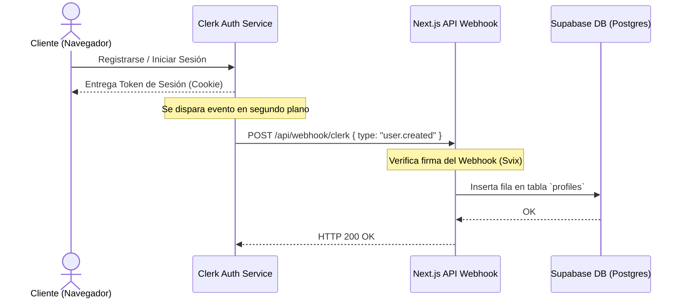

# 📑 Sección 8: Autenticación con Clerk

Esta sección detalla la integración de **Clerk** como el proveedor principal de autenticación, control de sesiones, protección de rutas y la sincronización de usuarios con la base de datos de Supabase.

---

## 🔒 Flujo General de Autenticación

Clerk maneja de forma segura el registro, inicio de sesión e inicio de sesión social (OAuth). El sistema sincroniza asíncronamente los perfiles creados en Clerk con nuestra tabla `profiles` en PostgreSQL mediante webhooks.

---

## ⚡ Manejo de Eventos (Clerk Webhooks)

El endpoint [app/api/webhook/clerk/route.ts](file:///C:/REPOS/EloyWasll%20dashboard/portafolio%20STUDIO/EW/app/api/webhook/clerk/route.ts) recibe y procesa las actualizaciones de cuentas desde los servidores de Clerk.

> [!IMPORTANT]
> Los webhooks de Clerk vienen firmados con encabezados criptográficos. Se debe utilizar la biblioteca `svix` para validar la firma (`svix-id`, `svix-timestamp`, `svix-signature`) utilizando la clave secreta `CLERK_WEBHOOK_SECRET`.

### Eventos Soportados

| Evento de Clerk | Acción en el Backend | Tabla Afectada |
| :--- | :--- | :--- |
| `user.created` | Inserta un nuevo registro con el ID único de Clerk, correo y nombre. | `profiles` |
| `user.updated` | Actualiza la información modificada por el usuario (nombre, foto de perfil). | `profiles` |
| `user.deleted` | Elimina o inhabilita el perfil de la base de datos. | `profiles` |

---

## 🛣️ Protección de Rutas (Next.js Middleware)

Para restringir el acceso a páginas privadas como `/dashboard` o la administración de compras, se utiliza el middleware de Clerk (`clerkMiddleware`).

### Rutas Públicas vs. Protegidas
*   **Públicas**: `/`, `/galeria`, `/diseno`, `/contacto`, `/api/webhook/clerk`, `/api/webhook/stripe`.
*   **Protegidas**: `/dashboard`, `/shop` (checkout), `/api/checkout`, `/api/subscribe`.

Cualquier intento de acceder a una ruta protegida sin un token válido de Clerk redirigirá automáticamente al usuario a la página de login.

---

## 🔑 Variables de Entorno de Clerk (.env)

Añade estas variables en tu archivo `.env.local` para activar la autenticación:

| Variable | Tipo | Descripción |
| :--- | :--- | :--- |
| `NEXT_PUBLIC_CLERK_PUBLISHABLE_KEY` | Público | Clave pública de Clerk para cargar componentes de login en el cliente |
| `CLERK_SECRET_KEY` | Privado | Clave secreta para peticiones de servidor a las APIs de Clerk |
| `CLERK_WEBHOOK_SECRET` | Privado | Secreto de Svix para validar firmas de webhook de Clerk |
| `NEXT_PUBLIC_CLERK_SIGN_IN_URL` | Público | Ruta de la página personalizada de inicio de sesión (`/login`) |
| `NEXT_PUBLIC_CLERK_SIGN_UP_URL` | Público | Ruta de la página personalizada de registro (`/register`) |
| `NEXT_PUBLIC_CLERK_AFTER_SIGN_IN_URL` | Público | Redirección por defecto tras loguearse (`/dashboard`) |
| `NEXT_PUBLIC_CLERK_AFTER_SIGN_UP_URL` | Público | Redirección por defecto tras registrarse (`/dashboard`) |
